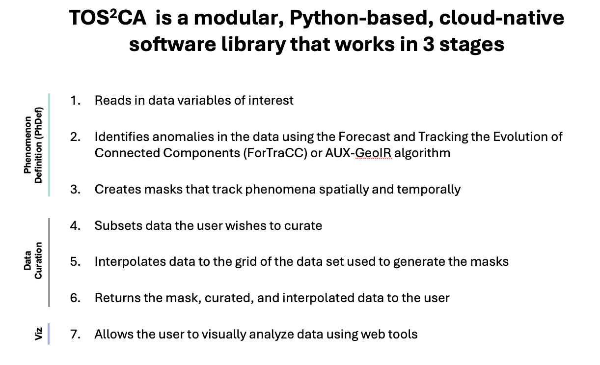
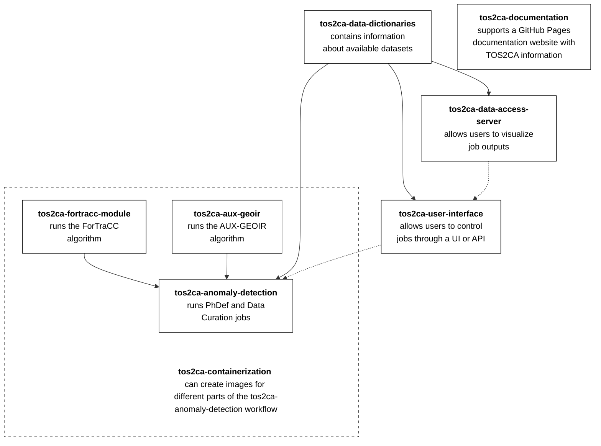

# Introduction

Documentation for each of TOS2CA's repository can be found on the left-side navigation bar.  It is also stored in each repository.  

## TOS2CA System Overview

TOS2CA was designed to be a modular system, allowing users to add new data readers, drop in their own anomaly detection algorithms, run jobs through APIs or web user interfaces, and use visualzation tools.  As such, TOS2CA has seperate repositories that have distinct parts of the system that can be used together or independently.  Below is a high-level overview of how all system components/repositories could be used together.

### Workflow

### Repository Relationships

